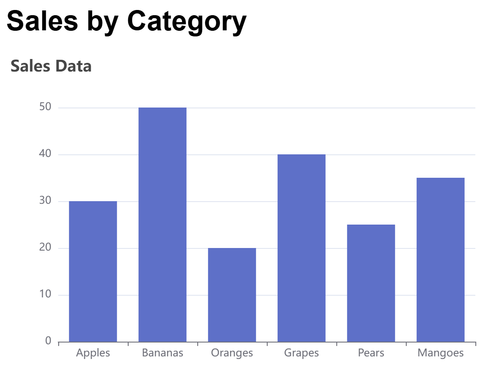
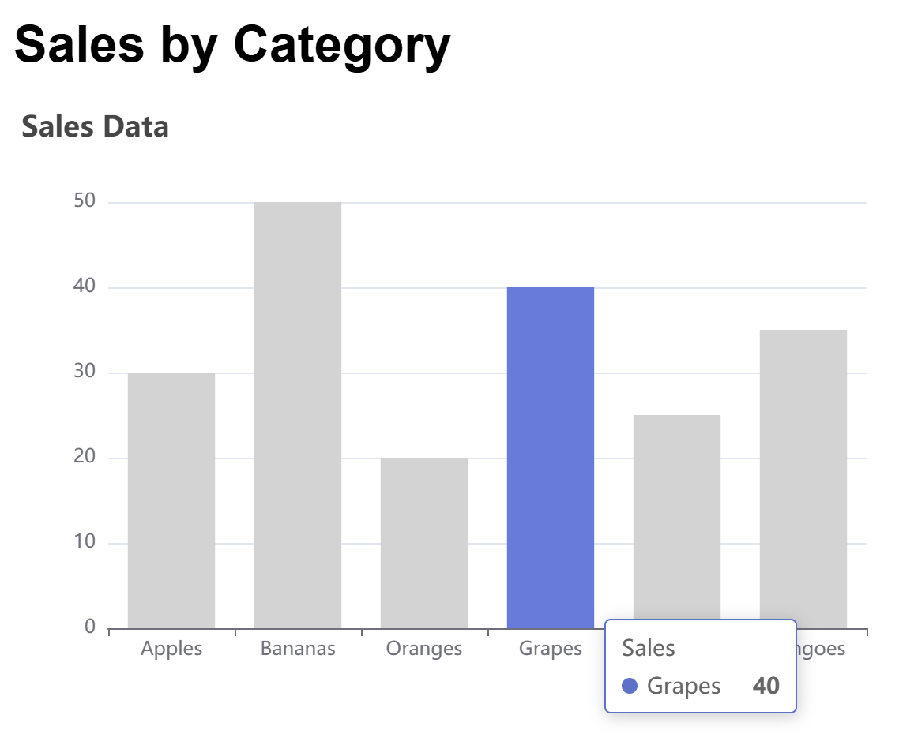

# Simple FastAPI + ECharts Web App

A simple web application using **FastAPI** for the backend API, **SQLite** for data storage, and **Apache ECharts** for interactive data visualization. The app displays a bar chart of sales data, where hovering over a bar highlights it and grays out other categories.

## Setup

1. Clone the repository:
   ```bash
   git clone https://github.com/pjlau/fastapi_echarts.git
   cd fastapi_echarts

2. Run the Web App:
   ```bash
   uvicorn app.main:app --reload
3. Open your browser to `http://127.0.0.1:8000` to view the app.


## Results

<br>

